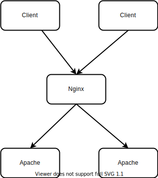

# Background

For the back-end understanding is not deep enough, and can not form a better system, I hope to build a more complete back-end infrastructure with the help of docker, and get more knowledge.

# Function

Use different ports to represent different machines.

- Load balancing based on nginx 8081

- code base php7.4,yaf

# Environment

name | version
-|-
ubuntu | 20.04
docker | 20.10.2
docker-compose | 1.29.2

## Extra

Used docker images

- nginx

- srcrs/nginx-yaf

base linux php7.4-fpm nginx

## Use

```sh
docker-compose up -d
```

# Schedule


